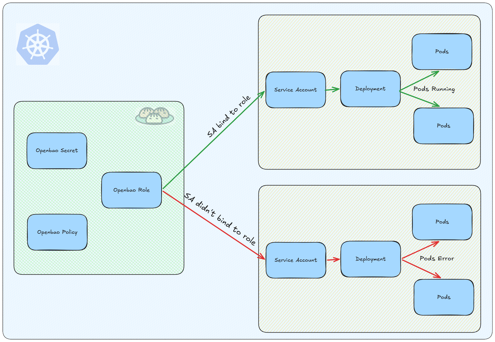

# Secret Store Management with OpenBao
OpenBao is forking project of Hashicorp Vault, OpenBao enable auto unsealing PKCS11 key where Hashicorp Vault required Vault Enterprise to using this feature. Let's setup the OpenBao (for minimun and easy clean up i would use container/kubernetes based).

## 1. Architecture
<p align="center">  </p>

## 2. Prequesites
- Kubernetes installed and configured
- Access to kubectl
- Helm installed and configured

## 3. Add Helm Repository
```sh
helm repo add openbao https://openbao.github.io/openbao-helm
helm repo add secrets-store-csi-driver https://kubernetes-sigs.github.io/secrets-store-csi-driver/charts
helm repo update
```
## 4. Create Static PVC's
This application would store sensitive data, and i didn't want to lost any data, so i will using static pvc.
```sh
kubectl apply -f manifest/openbao-pvc.yaml
```

## 5. Install OpenBao
```sh
# Create namespace and hsm pin in secret
kubectl create ns openbao
kubectl create secret generic openbao-hsm-pin --namespace openbao --from-literal=pin="OpenBao2026!" --from-literal=so-pin="SoPin2026!"

# Installing OpenBao
helm install openbao openbao/openbao -n openbao -f manifest/custom-openbao-values.yaml

# Make sure all pod was running
kubectl get po -n openbao

## Output
NAME                         READY   STATUS    RESTARTS   AGE
openbao-0                    1/1     Running   0          4h7m
openbao-csi-provider-zg6m8   2/2     Running   0          4h7m
```

## 6. Initialized OpenBao
```sh
kubectl exec -n openbao openbao-0 -- bao operator init -recovery-shares=3 -recovery-threshold=2 -format=json > openbao-init-pkcs11.json

# Do everytime 1 hour to access bao command
ROOT_TOKEN=$(python3 -c "import json; d=json.load(open('openbao-init-pkcs11.json')); print(d['root_token'])")
kubectl exec -n openbao openbao-0 -- bao login $ROOT_TOKEN

# Enable KVv2 and auth kubernetes
kubectl exec -n openbao openbao-0 -- bao secrets enable -path=secret kv-v2
kubectl exec -n openbao openbao-0 -- bao auth enable kubernetes

# Forward auth kubernetes to local cluster
kubectl exec -n openbao openbao-0 -- \
  bao write auth/kubernetes/config \
  kubernetes_host="https://kubernetes.default.svc.cluster.local:443" \
  disable_iss_validation=true
```
## 7. Install CSI Secret Driver
Install CSI Driver with helm chart
```sh
helm install csi-secrets-store secrets-store-csi-driver/secrets-store-csi-driver --namespace kube-system --set syncSecret.enabled=true --set enableSecretRotation=true --set rotationPollInterval=60s
```
## 8. Testing
Lemme use random data credentials for examples

- Store credentials in openbao
```sh
kubectl exec -n openbao openbao-0 -- bao kv put secret/production/myapp \
  APP_URL="http://aplikasiku.balamaru.my" \
  APP_USER="kuceng" \
  APP_PASSWORD="belagak"
```
- Create specific policy
```sh
cat > /tmp/myapp-policy.hcl <<'EOF'
# core-iam-svc hanya boleh baca path production/myapp saja
# tidak bisa akses path lain
path "secret/data/production/myapp" {
  capabilities = ["read"]
}
path "secret/metadata/production/myapp" {
  capabilities = ["read"]
}
EOF

kubectl cp /tmp/myapp-policy.hcl openbao/openbao-0:/tmp/myapp-policy.hcl
kubectl exec -n openbao openbao-0 -- bao policy write myapp-policy /tmp/myapp-policy.hcl
```
- Verify Policy
```sh
kubectl exec -n openbao openbao-0 -- bao policy read myapp-policy
```
- Bind SA to the openbao role
```sh
kubectl create sa myapp-sa
kubectl exec -n openbao openbao-0 -- \
  bao write auth/kubernetes/role/myapp-role \
  bound_service_account_names="myapp-sa" \
  bound_service_account_namespaces="default" \
  policies="myapp-policy" \
  ttl=1h
```
- Verify role
```sh
kubectl exec -n openbao openbao-0 -- bao read auth/kubernetes/role/myapp-role
```
- Apply Manifest
```sh
kubectl apply -f manifest/test-pod.yaml
```
- Verifikasi secrets termount dan env vars terbaca
```sh
kubectl exec openbao-myapp-test -- ls -la /mnt/secrets/
kubectl exec openbao-myapp-test -- env | grep -E "APP_URL|APP_USER|APP_PASSWORD"
```

## 9. References
- [Openbao Official Documentation](https://openbao.org/docs/)
- [Getting Started with OpenBao/Vault](https://labs.iximiuz.com/tutorials/openbao-vault-getting-started-e783c133)
- [The Guide to OpenBao](https://blog.stderr.at/openshift-platform/security/secrets-management/openbao/2026-02-11-openbao-part-1-introduction/)add