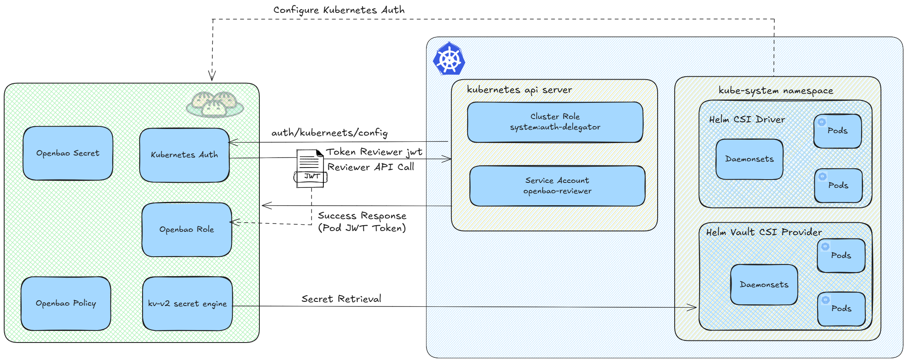

# External OpenBao
<p align="center">  </p>

## 1. Prequesites
- Installed Openbao external of kubernetes cluster

## 2. Steps
- Install CSI Driver + Provider in Kubernetes
```sh
helm repo add secrets-store-csi-driver https://kubernetes-sigs.github.io/secrets-store-csi-driver/charts
helm repo add hashicorp https://helm.releases.hashicorp.com
helm repo update

# 1. CSI Driver
helm install csi-secrets-store secrets-store-csi-driver/secrets-store-csi-driver --namespace kube-system --set syncSecret.enabled=true --set enableSecretRotation=true --set rotationPollInterval=60s

# 2. Vault CSI Provider
helm install vault-csi hashicorp/vault --namespace kube-system --set server.enabled=false --set injector.enabled=false --set csi.enabled=true --set "csi.extraArgs={--vault-addr=http://vault-or-openbao-url.com}"

# Verify
kubectl get pods -n kube-system | grep -E "csi|vault"
```

- Konfigurasi Kubernetes Auth di OpenBao (Bare Metal)

It clearly different with previous setup - external OpenBao need to verify JWT from kubernetes:
```sh
# Execute in OpenBao server
export BAO_ADDR="http://vault-or-openbao-url.com"
export BAO_TOKEN="s.your-bao-root-token"

# Enable kubernetes auth
bao auth enable kubernetes

# Configure — K8s API
# Get K8s API URL dan CA cert
K8S_HOST="https://YOUR_KUBE_IP:6443"
K8S_CA=$(kubectl config view --raw --minify \
  --flatten -o jsonpath="{.clusters[].cluster.certificate-authority-data}" \
  | base64 -d)

# Create specific SA for token reviewer
kubectl create serviceaccount openbao-reviewer -n kube-system 2>/dev/null || true

# Create ClusterRoleBinding
kubectl create clusterrolebinding openbao-reviewer \
  --clusterrole=system:auth-delegator \
  --serviceaccount=kube-system:openbao-reviewer 2>/dev/null || true

# Get token reviewer
REVIEWER_JWT=$(kubectl create token openbao-reviewer \
  -n kube-system --duration=8760h)

# Update OpenBao config with reviewer token
bao write auth/kubernetes/config \
  kubernetes_host="$K8S_HOST" \
  kubernetes_ca_cert="$K8S_CA" \
  token_reviewer_jwt="$REVIEWER_JWT" \
  disable_iss_validation=true

# Verify — token_reviewer_jwt_set must be true
bao read auth/kubernetes/config | grep token_reviewer

# Enable kv-v2 to store secret
bao secrets enable -path=secret kv-v2
```
- Test login
```sh
JWT=$(kubectl create token myapp -n default)
curl -s -X POST \
  -H "Content-Type: application/json" \
  -d "{\"jwt\":\"$JWT\",\"role\":\"myapp-role\"}" \
  http://vault-or-openbao-url.com/v1/auth/kubernetes/login | python3 -m json.tool
```